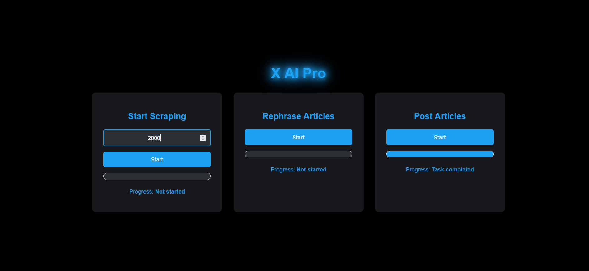
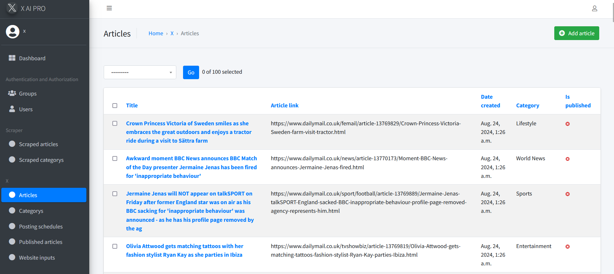

# 📰 Automated News Scraper & Publisher

## Introduction

Welcome to the **Automated News Scraper & Publisher** – a powerful web application that leverages cutting-edge technologies to streamline your content creation and distribution process. This application integrates advanced web scraping methodologies, the power of AI (GPT-4o-mini), and the robust Django framework to automate the entire workflow of news article collection, rephrasing, and publishing on X (formerly Twitter).

This project features a hand-curated library of 244 top news websites, blogs, and magazines, each meticulously analyzed to identify the exact selectors and XPath expressions needed to extract valuable content. With this tool, you can effortlessly scrape, rephrase, and publish thousands of articles daily, boosting your social media presence and engagement.

## Installation

To get started:

### Customize Your Sources:

- Modify, add, or remove websites in the `website_input.xlsx` file. This file contains two columns: one for URLs and another for selectors. For new sites, separate multiple selectors with a semicolon `";"`.
- If you'd like to use your own collection, clear the existing database table and import your customized input using:

    ```bash
    python manage.py import_website_input
    ```

### Install Dependencies:

- Ensure you have all the required dependencies installed by running:

    ```bash
    pip install -r requirements.txt
    ```

- Make migrations, migrate, and then run the server:

    ```bash
    python manage.py migrate
    python manage.py runserver
    ```

### Access the Admin Panel:

- Visit [http://localhost:8000/admin](http://localhost:8000/admin) to manage your database structure and monitor your content.

## Usage



### Stage 1: Scraping Articles

To scrape articles:

- Set your OpenAI API key in the `utils` file within the `scraper` folder.
- Start scraping articles with the command:

    ```bash
    python manage.py start_scraping --limit 5
    ```

- You can adjust the limit as per your strategy.
- Alternatively, use the minimal web interface at [http://127.0.0.1:8000/custom_admin/](http://127.0.0.1:8000/custom_admin/) to visually control the scraping process. Articles are saved in the "Scraped Articles" section of your database.

### Stage 2: Rephrasing Articles

Rephrasing ensures your content is unique and valuable:

- The `rephrase_utils.py` script utilizes GPT-4 to rephrase articles, add sources, and include relevant trending hashtags.
- Once rephrased, articles are stored in the "Articles" section with all necessary details like the original link, category, and images.

### Stage 3: Publishing Articles

For publishing:

- Due to the cost and limitations of the X API, Selenium and ChromeDriver are used for automated posting.
- Before running the script, ensure your X account session is active by logging in through Google Chrome and setting the `user-data-dir` in the `rephrase_utils.py` file:

    ```python
    options.add_argument("user-data-dir=C:/Users/<Your User>/AppData/Local/Google/Chrome/User Data")
    ```

- This setup enables posting up to 3000 articles within 24 hours while maintaining a seamless session throughout.




## Recommendations

- **X Pro Account**: To maximize efficiency, consider using a Pro X account.
- **Targeted Content**: Focus on specific news categories to enhance engagement and reach.

## Deployment Advice

This app runs perfectly locally. For proper deployment, I recommend using a **virtual machine** rather than a SaaS platform like Azure or Heroku. Additionally, I strongly advise deploying it on a **Windows-based server** to ensure compatibility and performance.

## Discussion

This app is still under development and open for contributions. The idea behind this app is to work around social media account limitations and merge the power of Python for scraping with OpenAI in the media and news sectors. The ad revenue of X isn't the best out there, and the rules for monetizing your account may be among the strictest, with 5 million impressions needed over 3 months at a minimum. This app can help you overcome these hurdles by continuously posting every day.

The ad revenue is reported to pay out $8 per 1 million impressions, which may seem low. However, if you set the bar high and utilize this app properly, starting with as little as 10k followers, and assuming you get impressions from 25% of them by posting 2000 articles a day, you could achieve 5 million impressions daily. While this might be too optimistic, it guarantees a broader reach for both followers and non-followers.

Once monetized, you can maintain the same strategy, potentially earning $40 a day. As your follower base grows to at least 100k, you might reduce the number of articles posted to 100 a day, guaranteeing 50% of their impressions, which can keep your daily revenue close to $40.

Again, these are personal calculations based on optimistic assumptions. Things might turn out better or worse, but with such a tool at hand, it becomes much easier to find content to publish when others are doing it for you, and AI is handling the rest.
